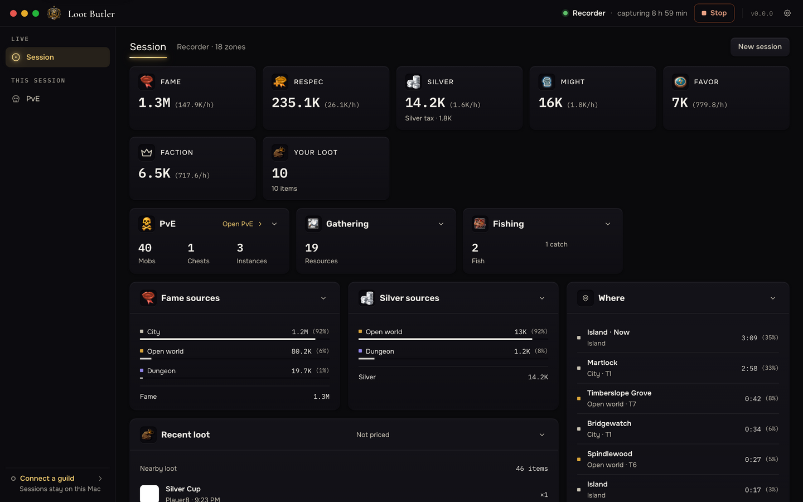
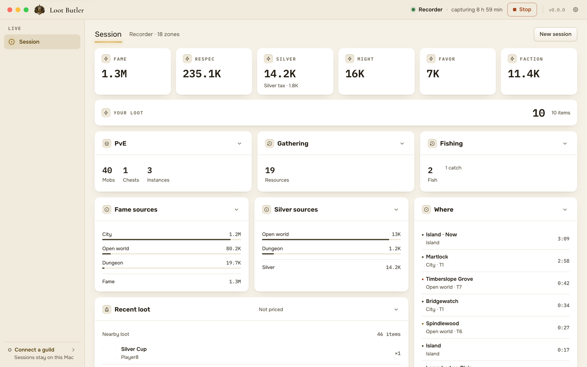
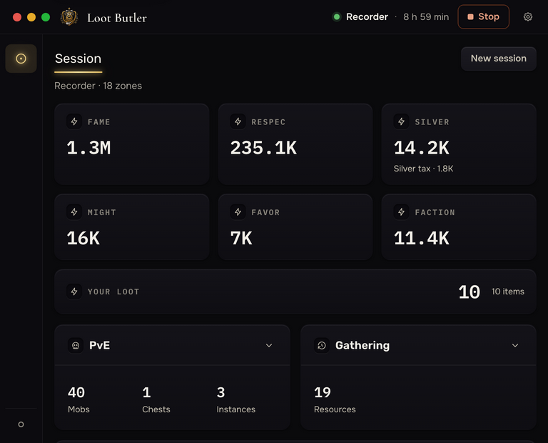
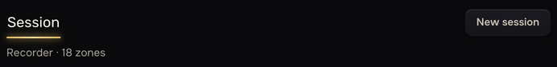
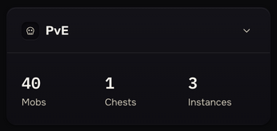
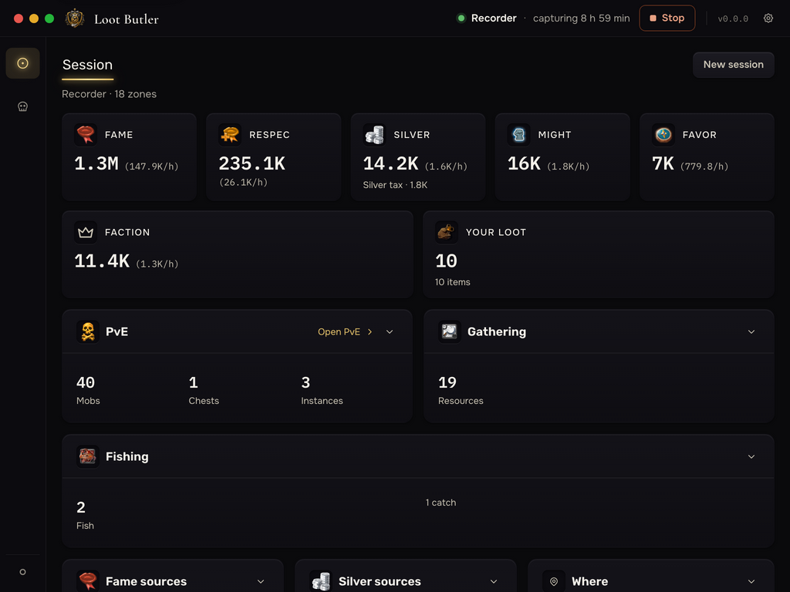
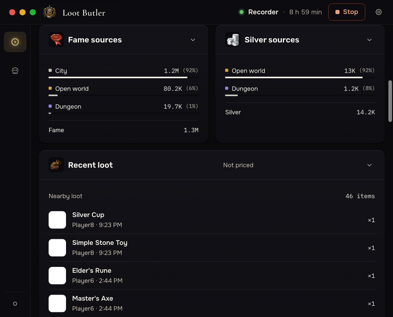
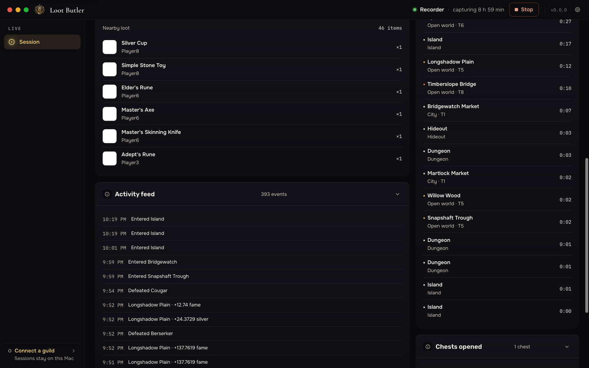
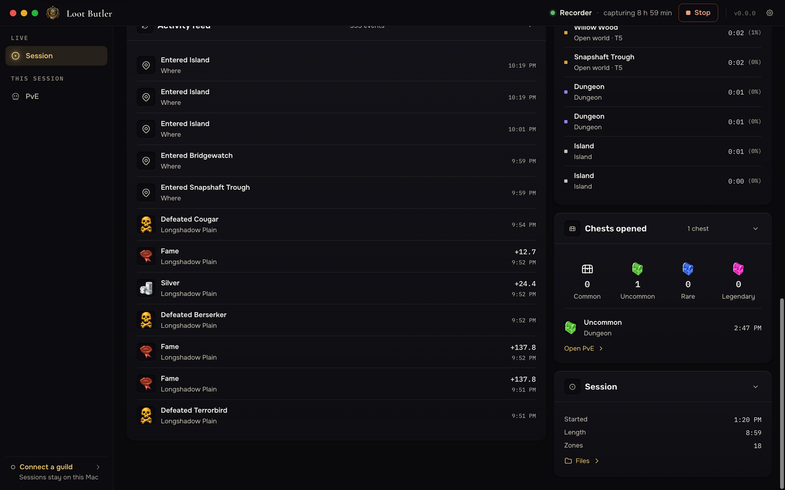

# Session F1 — built proof, 2026-10-03

Built `dist/web/app` at 0.8.8, from the scrubbed 2026-09-21 evening through the
real reducer. Counter acceptance and provenance: [recording](../../test/fixtures/session/README.md).
Architecture and verification: [Session](../session.md).

Acceptance follows the [approved design implementation flow](implementation-flow.md).

Approved source: F1/variants and Fr on the [v5 canvas](https://claude.ai/artifact/FbLQ85VeKLddohadcMNqYT).
The owner's 2026-10-03 F1 ZIP is retained at
`~/albion/loot-butler-build/source-exports/F1-approved-2026-10-03.zip`; its `F1.dc.html` SHA-256 is
`d02ff8143da934b4170ddfa43d74359ee86cf2fbf86a35224314caee66d7bd0f`.
Responsive/state boards remain in that project's `boards/`; native asset hashes are recorded in
[provenance](../../resources/albion/PROVENANCE.md).

| Readiness | Current evidence / limits |
| --- | --- |
| Data correctness | Recorded totals, real tracker/IPC and summary/reset/Stop/quit checks pass for supported fields; R5 and other unobserved fields remain unavailable |
| Visual fidelity | Partial: supported icon/rate/bar/link/Fr corrections are built and pictured below; a comprehensive comparison against every approved state is still pending, so the whole screen is not certified complete |
| Live-game verification | Partial: owner confirmed tracking in the earlier Mac preview; final native-art build awaits fresh game traffic, full Mac/Windows flush and assistive-technology evidence |

| Approved board   | Built status                                                                                                                                                                                                       | Remaining gaps                                                                                                             |
| ---------------- | ------------------------------------------------------------------------------------------------------------------------------------------------------------------------------------------------------------------ | -------------------------------------------------------------------------------------------------------------------------- |
| F1               | Approved native currency/activity icons, session-average hourly rates, ranked source bars and percentages, content markers, PvE links, loot, chest rarity strip and illustrated feed; New session and journal completions | R5 item values and comparisons; party, journal progress and unbuilt page links; unsupported native portraits/rarities retain fallbacks |
| F1r1024 / F1r768 | Rail; five KPI columns at 1024, three plus two at 768 for five tiles; two activity columns below 1280 and side-by-side sources, with rows filling the width; header metadata clears the tab underline by 8px                                                   | Native Windows/assistive technology verification pending                                                                   |
| F1n              | Before-data face retained after a successful reset                                                                                                                                                                 | History/export/share controls await their slices                                                                           |

The recording contains currencies not present in the board's example: silver and
faction points also get tiles. Loot remains a quantity tile in the same strip while values are unavailable. Partial KPI rows spread equally. Rates share the main number’s baseline and wrap when needed, as Fr specifies.
Activity counters divide the card width evenly. A partial row of activity cards fills the available width, including captures with only PvE. Rates use the full session duration and freeze at Stop; a zero-duration session has no rate. Source percentages and bars share the same captured total; fill stays neutral and dims by rank. Content squares retain F1/F3 category colours. Chest rarity counts use all visits, including unplaced events, and remain complete beyond the 61-event preview. PvE card and chest links reach the existing page. The feed uses official item art where available, matching supplied mob/chest/currency sprites or outline event icons otherwise, actual gain amounts, places and times.
A dynamic dungeon is called Dungeon: its UUID cannot tell solo from group. The
recorded elapsed evening includes time between the two engine runs. The page
scrolls to retain every observed place; the screenshots below show its different
positions. Item art is a deterministic one-pixel PNG stub in these proofs;
the official protocol/cache has independent tests. Native sprites come from the owner’s F1/F3 exports and render as real packaged bytes; [provenance](../../resources/albion/PROVENANCE.md) records the subset and hashes. OS caption controls are marked
stand-ins and the stub's version says v0.0.0.

Slice 2 adds an independent September 16 [journal-feed proof](journals-proof.md).
It contains no observed currency gains: empty currency/activity/source wrappers
are omitted so the first cards align without reserved gaps. This excerpt is not
combined with the September 21 evening below.

Regenerate with a build, then:

```sh
ONLY=session OUT=<folder> pnpm exec electron --no-sandbox tools/shell-shots.cjs
```

| Theme | 1440 × 900 | 1024 × 768 | 768 × 620 |
| --- | --- | --- | --- |
| Obsidian | [Proof](session/obsidian-1440.png) | [Proof](session/obsidian-1024.png) | [Proof](session/obsidian-768.png) |
| Parchment | [Proof](session/parchment-1440.png) | [Proof](session/parchment-1024.png) | [Proof](session/parchment-768.png) |

Obsidian, 1440 × 900:



Parchment, 1440 × 900:



Obsidian, 768 × 620:



Header detail at 768: metadata has its own row below the underline's glow.



PvE detail at 768: equal-width columns for mobs, chests and instances.



At 1024, the strip keeps five equal tiles on its first row and source cards stay side by side:



Sources and recent loot at 768 × 620, after scrolling:



Recent loot and feed, after scrolling:



Chests and session summary, at the end:



The 2026-10-03 owner test exposed missing approved UI despite passing counter and overflow gates. The rate, icon, percentage and link gaps were implementation omissions, not decoder dependencies. The renderer gate now checks these details, and the main/preload replay follows the card link with Enter and checks page focus.
